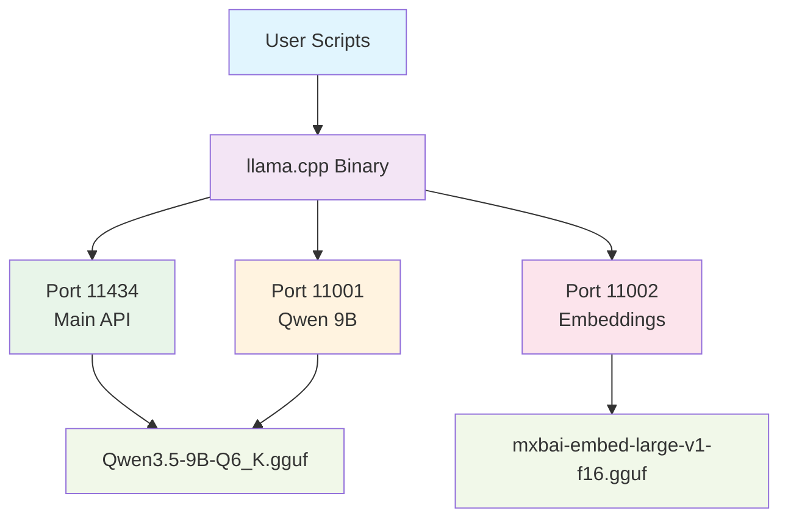

# Llama.cpp CUDA Setup

Local LLM inference server configuration using the [llama.cpp](https://github.com/ggml-org/llama.cpp) library, optimized for NVIDIA GPUs.

## Overview

This workspace provides scripts and configuration for running large language models locally with CUDA acceleration. The setup supports multiple models simultaneously for different purposes including LLM inference and embedding generation.

## Files

| File | Purpose |
|------|---------|
| [`models.ini`](models.ini) | Configuration file with model settings (context size, GPU allocation, cache types) |
| [`run_llama.sh`](run_llama.sh) | Simple launcher for llama-server on port 11434 |
| [`update_llama.sh`](update_llama.sh) | Build script: installs CUDA Toolkit 12.8, clones llama.cpp, builds with CUDA support |
| [`startqwen128.sh`](startqwen128.sh) | Starts Qwen 9B (128k context) + embedding model on GPU 1 |
| [`startqwen256.sh`](startqwen256.sh) | Starts Qwen 9B (256k context) using dual GPUs (0+1) with flash attention |

## Key Configuration

- **Model**: Qwen3.5-9B-Q6_K.gguf (quantized coding LLM)
- **Embedding Model**: mxbai-embed-large-v1-f16.gguf
- **GPU Target**: CUDA architecture `120a` (Ampere - RTX 30xx/A100)
- **Context Sizes**: 128k and 256k options
- **Optimizations**: Flash attention, q8_0 cache, layer splitting

## Models Configuration

### Qwen3.5-9B-Q6_K.gguf
- **Alias**: `qwen3:9b`
- **Context Size**: 131072 (128k)
- **Device**: cuda1 (GPU 1)
- **Split Mode**: none (100% on GPU)
- **Cache Type**: q8_0 for K and V caches

### mxbai-embed-large-v1-f16.gguf
- **Alias**: `embedding-model`
- **Context Size**: 1024
- **Device**: cuda1 (GPU 1)
- **Embedding Mode**: enabled

## Usage

### Build with CUDA
```bash
./update_llama.sh
```

This script will:
1. Install CUDA Toolkit 12.8 for Ubuntu 24.04 (if not present)
2. Clone or update the llama.cpp repository
3. Build with CUDA support (`GGML_CUDA=ON`)
4. Target GPU architecture `120a` (Ampere)

### Start Server

#### Simple Mode
```bash
./run_llama.sh
```
Starts llama-server on port 11434 with both models enabled.

#### Specific Configurations

**128k Context (Single GPU)**
```bash
./startqwen128.sh
```
- Port 11001: Qwen 9B with 128k context on GPU 1
- Port 11002: Embedding model on GPU 1

**256k Context (Dual GPU)**
```bash
./startqwen256.sh
```
- Port 11001: Qwen 9B with 256k context using GPUs 0+1
- Flash attention enabled
- Layer splitting across GPUs

## Ports

| Port | Service | Description |
|------|---------|-------------|
| 11434 | Main API | Standard llama-server port |
| 11001 | Qwen 9B | Coding model inference |
| 11002 | Embeddings | Vector embedding generation |

## Architecture



## Environment Variables

The scripts set the following environment variables:

```bash
CUDA_VISIBLE_DEVICES=0,1  # Specify which GPUs to use
CUDA_HOME=/usr/local/cuda # CUDA toolkit path
LD_LIBRARY_PATH           # Add CUDA libraries to path
```

## Requirements

- **OS**: Ubuntu 24.04 (tested)
- **GPU**: NVIDIA Ampere architecture (RTX 30xx, A100, etc.)
- **CUDA**: Toolkit 12.8
- **Memory**: Sufficient VRAM for model loading
  - Qwen 9B Q6_K: ~6-7 GB VRAM
  - mxbai-embed-large: ~2-3 GB VRAM

## Integration

The setup is designed for **Roo Code Chat** integration:
- Main API: http://localhost:11434
- Coding Model: http://localhost:11001
- Embeddings: http://localhost:11002

## Troubleshooting

### CUDA Not Found
```bash
# Check if CUDA is installed
nvcc --version

# If not installed, run:
./update_llama.sh
```

### Port Already in Use
The scripts include cleanup commands to kill existing processes:
```bash
sudo fuser -k 11001/tcp
sudo fuser -k 11002/tcp
```

### VRAM Issues
- Use `startqwen256.sh` for dual-GPU distribution
- Reduce context size in `models.ini` if needed
- Use lower quantization (Q4_K instead of Q6_K)

## Server Parameters

This section documents the command-line parameters available for the llama-server command used in this setup. These parameters control various aspects of model loading, server configuration, performance optimization, and API behavior.

### Core Model Parameters
- **`-m, --model FILE`** - Path to the GGUF model file to load
- **`--alias ALIAS`** - Model alias for identification in API calls
- **`--ctx-size N`** - Context size in tokens (e.g., 131072 for 128k, 262144 for 256k)
- **`--n-gpu-layers N`** - Number of layers to offload to GPU for acceleration
- **`--split-mode MODE`** - Split mode for multi-GPU setups (none, layer, row)
- **`--main-gpu N`** - Main GPU index for model loading
- **`--device DEVICE`** - GPU device specification (e.g., cuda0, cuda1)

### Server Configuration
- **`--host HOST`** - Host address to bind to (default: 127.0.0.1)
- **`--port PORT`** - Port number for the API server (default: 8080)
- **`--api-key KEY`** - API key for authentication
- **`--timeout N`** - Server timeout in seconds (default: 600)
- **`--threads N`** - Number of threads to use for processing
- **`--threads-http N`** - Number of threads for HTTP requests
- **`--parallel N`** - Number of parallel requests to handle
- **`--batch-size N`** - Batch size for processing
- **`--ubatch-size N`** - Micro batch size for memory optimization

### Performance Options
- **`--flash-attn ON/OFF`** - Enable/disable flash attention for faster attention computation
- **`--jinja ON/OFF`** - Enable/disable Jinja template engine for chat formatting
- **`--embedding`** - Enable embedding mode for vector generation
- **`--cont-batching`** - Enable continuous batching for improved throughput
- **`--metrics`** - Enable Prometheus compatible metrics endpoint for monitoring
- **`--cache-prompt`** - Enable prompt caching to improve response times
- **`--cache-reuse N`** - Minimum chunk size for cache reuse via KV shifting

## Metrics Endpoint

The `--metrics` flag enables a Prometheus-compatible metrics endpoint that provides detailed performance insights about the server's operation. When enabled, metrics are exposed at the `/metrics` endpoint.

### How to View Metrics

1. **Enable metrics**: Start the server with the `--metrics` flag
2. **Access metrics**: Make a GET request to `http://localhost:PORT/metrics` (replace PORT with your server's port)
3. **Example command**: `curl http://localhost:11434/metrics`

### Available Metrics

The metrics endpoint exposes the following key metrics:
- `llamacpp:prompt_tokens_total` - Total number of prompt tokens processed
- `llamacpp:tokens_predicted_total` - Total number of generation tokens processed
- `llamacpp:prompt_tokens_seconds` - Average prompt throughput in tokens/second
- `llamacpp:predicted_tokens_seconds` - Average generation throughput in tokens/second
- `llamacpp:kv_cache_usage_ratio` - KV-cache usage ratio (0.0 to 1.0)
- `llamacpp:kv_cache_tokens` - Number of tokens currently in KV-cache
- `llamacpp:requests_processing` - Number of requests currently being processed
- `llamacpp:requests_deferred` - Number of requests deferred due to resource constraints
- `llamacpp:n_tokens_max` - High watermark of context size observed

### Monitoring Tools

The metrics can be consumed by various monitoring tools:
- **Prometheus**: Direct scraping of the metrics endpoint
- **Grafana**: Visualize metrics in dashboards
- **Command line**: Use `curl` or `wget` to fetch metrics
- **Application monitoring**: Integrate with existing monitoring systems

### Example Usage

To enable metrics in your setup, modify your server startup command to include `--metrics`:
```bash
./llama-server --model model.gguf --port 11434 --metrics
```

Then access the metrics:
```bash
curl http://localhost:11434/metrics
```

### Quantization and Cache
- **`--cache-type-k TYPE`** - Cache type for key matrices (e.g., q8_0, f16)
- **`--cache-type-v TYPE`**** - Cache type for value matrices (e.g., q8_0, f16)
- **`--ctx-shift`** - Enable context shifting for extended context handling
- **`--swa-full`** - Enable SWA full mode for specific model optimizations

### Model Management
- **`--models-dir PATH`** - Directory containing models for router server
- **`--models-preset PATH`** - Path to INI file with model presets
- **`--models-max N`** - Maximum number of models to load simultaneously
- **`--models-autoload`** - Enable automatic model loading

### Sampling Parameters
- **`--temp N`** - Temperature for sampling (default: 0.8) - controls randomness
- **`--top-k N`** - Top-k sampling value - limits vocabulary to top K tokens
- **`--top-p N`** - Top-p (nucleus) sampling value - cumulative probability threshold
- **`--repeat-penalty N`** - Penalty for repeated tokens
- **`--presence-penalty N`** - Penalty for presence of tokens
- **`--frequency-penalty N`**** - Penalty for frequency of tokens

### Advanced Options
- **`--slot-prompt-similarity SIM`** - Prompt similarity threshold for slot reuse
- **`--reasoning-format FORMAT`** - Format for reasoning output
- **`--reasoning-budget N`** - Budget for reasoning tokens
- **`--chat-template JINJA`** - Custom Jinja chat template
- **`--chat-template-file FILE`** - File containing custom Jinja template
- **`--prefill-assistant`** - Prefill assistant responses if last message is assistant

## License

This setup uses the llama.cpp library which is licensed under MIT. Model files are subject to their respective licenses.
